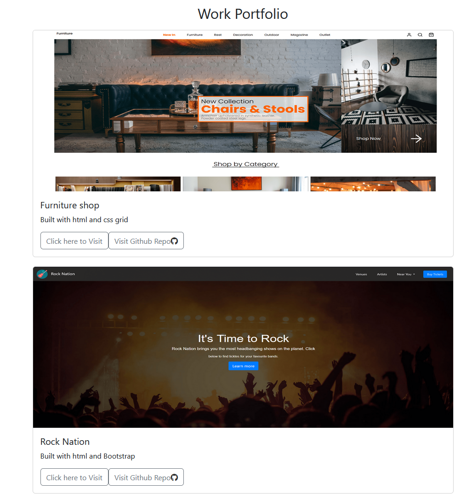
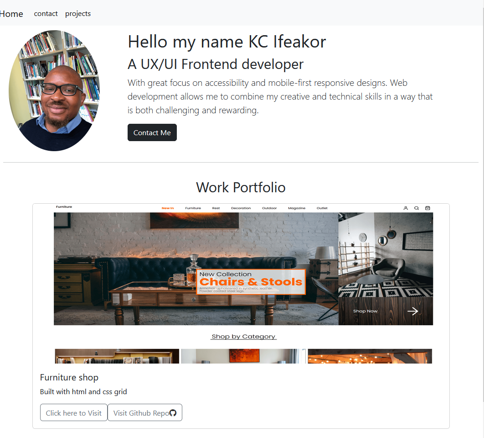

# My portfolio built on React

Welcome to my portfolio! This project is a showcase of my frontend development skills, including my design process and completed projects

## project cards

the project cards shown below showcase my completed projects, including a brief description of the technology used to build the project and a button that link to view the project live. I have included projects that demonstrated my skills in HTML, CSS and responsive design

## Contact Page 

the contact page includes links to my socail media that allows visitors to get in touch with me 

## Final Thoughts

I hope you enjoy exploring my portfolio. If you have any questions or would like to work with me, please don't hesitate to reach out through the contact form or any of my social media profiles. Thank you for visiting!

This site is deployed using [GitHub Pages](https://pages.github.com/) at https://kifeakor22.github.io/react-portfolio/

